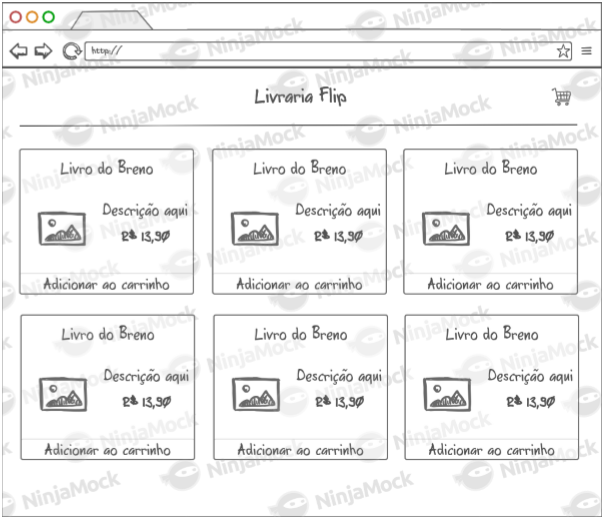
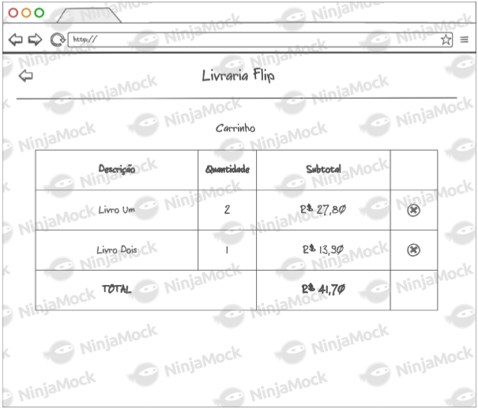

# Livraria

## Objetivo

Criar um site de vendas para uma livraria de acordo com os mockups nesse documento.
Esse site terá duas páginas: a home e o carrinho.

### Página home

Ela deverá exibir uma lista de livros quaisquer com os seguintes atributos:
- foto
- título
- descrição
- valor

Além disso, cada livro deverá possuir um botão para que uma unidade do livro seja adicionada ao carrinho.

### Página carrinho

A página do carrinho deverá exibir uma tabela agrupada por livro com os detalhes:
- descrição
- subtotal
- total geral

Deve ser possível remover os livros adicionados no carrinho.

## Premissas

O site deverá ser um single page app e, consequentemente, não deverá ocorrer perdas de dados (estados) ao navegar entre as páginas.

O layout deve ocupar a tela toda (vertical e horizontalmente) e ser responsivo.

O projeto deve estar "pronto para produção em termos de: estruturação e formatação de código, performance (client/server) e segurança

## Mais informações

Use sua criatividade para melhorar ainda mais e criar coisas interessantes em todos aspectos, principalmente UX.

Lembre-se que queremos ver todo o seu conhecimento e boas práticas neste projeto, portanto cuide do estilo de código, organização do projeto, tomada de decisão, idéias, simplicidade, performance, escalabilidade, robustez, etc.

Envie para nós o link do GitHub ou BitBucket onde está o projeto e o prazo que você irá entregá-lo.
Caso hospede em algum lugar, mande o link do app.

## Extra

Armazenar o carrinho no banco de dados para um usuário. Escolha o banco de dados.
Autenticação de usuário.